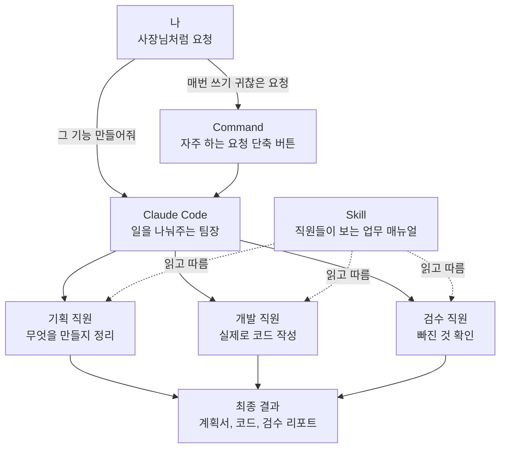
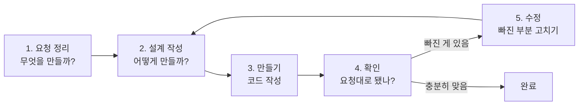

# Claude Code Subagents, Skills, Commands

## 한 줄 설명

Claude Code에서 서브에이전트, 스킬, 커맨드는 AI 코딩 결과물을 더 일관되게 만들기 위한 역할 분리 도구다.

- Subagent: 특정 역할을 맡는 AI 직원
- Skill: 여러 에이전트가 따라야 하는 작업 규칙
- Command: 자주 쓰는 요청 흐름을 짧게 실행하는 명령어

## 왜 필요한가

AI에게 "투두 앱 만들어줘"처럼 짧게 요청하면 결과물이 매번 달라질 수 있다.

예를 들어 같은 요청을 해도 한 번은 탭 기능이 들어가고, 다른 한 번은 삭제 기능만 들어갈 수 있다. AI가 어떤 기준으로 기능을 넣고 뺐는지 사용자가 알기 어려워지면 결과물이 블랙박스가 된다.

이 문제를 줄이려면 사람이 모든 요구사항을 매번 길게 쓰는 대신, AI가 따라야 할 역할과 규칙을 미리 만들어 두는 방식이 필요하다.

## 핵심 관점

핵심은 "개발자가 CEO처럼 일해야 한다"는 것이다.

기존 방식은 사용자가 직접 기획, 설계, 구현 요청, 테스트, 코드 리뷰를 모두 챙기는 구조에 가깝다. 반면 서브에이전트를 활용하면 다음과 같이 역할을 나눌 수 있다.

- 기획 에이전트: 요구사항을 구체화하고 계획을 만든다.
- 구현 에이전트: 설계를 바탕으로 코드를 작성한다.
- QA 에이전트: 계획과 실제 구현이 맞는지 검증한다.
- 리뷰 에이전트: 코드 품질, 누락, 개선점을 확인한다.

사용자는 모든 세부 작업을 직접 처리하는 사람이 아니라, 각 역할을 가진 에이전트를 만들고 지시하는 사람이 된다.

## 전체 구조 그림

먼저 개발 도구라고 생각하지 말고, 작은 회사라고 생각하면 쉽다.

- 사용자: 사장님
- Claude Code: 일을 받아서 나눠주는 팀장
- Subagent: 기획자, 개발자, QA 같은 직원
- Skill: 직원들이 따라야 하는 업무 매뉴얼
- Command: 자주 하는 업무 요청을 줄여 놓은 단축 버튼



이 그림의 핵심은 간단하다. 사용자가 모든 일을 직접 하는 게 아니라, Claude Code가 일을 나누고 각 서브에이전트가 자기 역할을 맡는다. 스킬은 모든 직원이 참고하는 규칙이고, 커맨드는 반복 요청을 짧게 부르는 버튼이다.

---

## Subagent

### 설명

서브에이전트는 특정 목적에 최적화된 보조 AI다. Claude Code는 사용자의 요청을 보고, 에이전트 설명에 맞는 작업이라고 판단하면 해당 에이전트를 호출할 수 있다.

예를 들어 다음과 같은 에이전트를 만들 수 있다.

- 요구사항을 구체화하고 계획을 짜는 에이전트
- 시니어 개발자 관점으로 코드를 구현하는 에이전트
- 구현 결과가 설계 문서와 일치하는지 확인하는 에이전트

### 만드는 흐름

1. Claude Code에서 에이전트 생성 메뉴를 연다.
2. Personal 또는 Project 범위를 선택한다.
3. 어떤 역할의 에이전트인지 설명한다.
4. 권한, 모델, 색상 등을 설정한다.
5. 생성된 에이전트 파일을 프로젝트에 맞게 계속 수정한다.

### 중요한 점

에이전트는 처음부터 완벽한 직원이 아니라 초안에 가깝다. 프로젝트를 진행하면서 설명, 책임, 금지사항, 선호하는 방식 등을 계속 보강해야 한다.

에이전트가 언제 호출될지는 설명문이 중요하다. 설명문에 "새 기능 구현 시 사용", "요구사항 분석 시 사용"처럼 명확히 적어야 Claude Code가 적절한 시점에 선택하기 쉽다.

### 예시

```txt
요구사항을 구체화하고 계획을 짜주는 계획 에이전트를 만들어줘.
데이터베이스 스키마, 기술 스택, 폴더 구조까지 제안하게 해줘.
```

```txt
코드를 구현하는 에이전트를 만들어줘.
시니어 개발자 관점에서 확장성이 좋고 클린 아키텍처를 기반으로 작성하게 해줘.
```

---

## Skill

### 설명

스킬은 에이전트들이 공통으로 따라야 하는 규칙이나 지식이다.

서브에이전트가 "역할을 가진 직원"이라면, 스킬은 "직원에게 나눠주는 온보딩 문서나 업무 규칙"에 가깝다.

### 언제 사용하는가

다음처럼 여러 작업에 반복 적용되는 기준이 있을 때 스킬로 만들기 좋다.

- 코드 주석은 한국어로 쉽게 작성한다.
- 비전공자도 이해할 수 있게 설명한다.
- 특정 폴더 구조를 따른다.
- 특정 테스트 방식이나 코드 스타일을 유지한다.
- 프로젝트 문서 작성 형식을 통일한다.

### 예시

```md
# Code Rules

- 비전공자도 이해할 수 있게 코드마다 한국어 주석을 쉽게 달아줘.
- 함수가 왜 필요한지 짧게 설명해줘.
- 복잡한 로직은 단계별로 나눠서 작성해줘.
```

이후 요청할 때는 다음처럼 사용할 수 있다.

```txt
todos 폴더에 있는 MD 파일을 참고해서 마감일 기능을 만들어줘.
```

### Subagent와 Skill의 차이

| 구분 | Subagent | Skill |
| --- | --- | --- |
| 핵심 역할 | 특정 일을 맡는 전문 역할 | 여러 작업에 적용되는 규칙 |
| 비유 | 기획자, 개발자, QA 같은 직원 | 직원들이 따라야 하는 업무 매뉴얼 |
| 사용 시점 | 특정 단계나 역할이 필요할 때 | 일관된 기준을 유지하고 싶을 때 |
| 예시 | 계획 에이전트, 구현 에이전트 | 코드 스타일 규칙, 문서 작성 규칙 |

---

## Command

### 설명

커맨드는 자주 쓰는 긴 요청을 짧은 명령어로 실행하기 위한 기능이다.

매번 "서브에이전트를 이용해서 구현하고, 스킬 문서도 참고해서 만들어줘"라고 쓰는 대신, `/develop` 같은 명령어로 묶어둘 수 있다.

### 언제 사용하는가

반복되는 작업 흐름이 있을 때 사용한다.

- 새 기능 구현
- 계획 문서 생성
- 설계 문서 생성
- 구현 후 검증
- 최종 리포트 작성

### 예시

```txt
/develop 마감일 기능을 추가해줘.
```

이 명령어 안에 다음 규칙을 미리 넣어둘 수 있다.

- 적절한 서브에이전트를 사용한다.
- 관련 스킬 문서를 참고한다.
- 구현 전 계획을 확인한다.
- 구현 후 누락 기능을 점검한다.

---

## 추천 워크플로

### 1. Plan

먼저 바로 코드를 만들지 않고 기능 계획을 만든다.

- 어떤 기능을 만들지
- 필요한 데이터 구조는 무엇인지
- 어떤 파일 구조가 적절한지
- 어떤 UI 흐름이 필요한지

### 2. Design

계획을 바탕으로 설계를 구체화한다.

- 아키텍처
- 파일별 역할
- 함수 흐름
- 상태 관리 방식
- UI 레이아웃

### 3. Implement

설계 문서를 기준으로 코드를 작성한다. 이때 구현 에이전트가 설계에 맞춰 파일과 코드를 만든다.

### 4. Analyze

구현 결과가 계획과 설계에 맞는지 분석한다.

예를 들어 "설계와 실제 코드가 96% 일치한다"처럼 문서 대비 구현 상태를 확인할 수 있다. 누락된 기능이나 UI 차이도 이 단계에서 발견한다.

### 5. Iterate

일치도가 낮거나 누락이 있으면 다시 수정한다. 이때 코드부터 직접 고치는 것이 아니라, 계획이나 설계 문서를 먼저 고친 뒤 그 기준으로 다시 구현하는 것이 일관성을 유지하기 좋다.

## 작업 흐름 그림

이 흐름은 음식을 주문하고 확인하는 과정처럼 보면 쉽다.

1. 먼저 어떤 음식을 만들지 정한다.
2. 레시피와 재료를 정리한다.
3. 실제로 만든다.
4. 주문한 내용과 맞는지 확인한다.
5. 부족하면 다시 고친다.



중요한 점은 바로 만들지 않는 것이다. 먼저 요청을 문서로 정리하고, 그 문서대로 만들고, 마지막에 문서와 결과물이 맞는지 확인한다. 그래서 AI가 매번 다르게 만드는 문제를 줄일 수 있다.

---

## 좋은 점

### 결과물의 일관성

계획 문서와 설계 문서를 먼저 만들면 같은 기능을 다시 만들더라도 비슷한 구조와 품질로 재현하기 쉽다.

### 블랙박스 감소

AI가 왜 이런 기능을 만들었는지 문서로 남기기 때문에 결과물을 이해하고 수정하기 쉬워진다.

### 역할 분리

한 AI에게 모든 일을 한 번에 맡기는 대신, 계획, 구현, 검증을 나눠서 맡길 수 있다.

### 재사용성

잘 만든 에이전트, 스킬, 커맨드는 다른 기능을 만들 때도 계속 사용할 수 있다.

---

## 주의할 점

- 작은 앱에는 과한 구조가 될 수 있다.
- 에이전트는 처음 생성한 뒤 계속 다듬어야 한다.
- 스킬은 너무 넓고 추상적으로 쓰면 효과가 떨어진다.
- 커맨드는 반복되는 흐름이 명확할 때 만드는 것이 좋다.
- AI 분석 결과도 완전히 믿기보다 중요한 부분은 사람이 확인해야 한다.

## 요약

- 서브에이전트는 역할을 나누기 위한 도구다.
- 스킬은 반복 적용되는 규칙을 저장하는 도구다.
- 커맨드는 반복되는 요청 흐름을 짧게 실행하는 도구다.
- 좋은 AI 코딩 흐름은 바로 구현하는 것이 아니라 계획, 설계, 구현, 검증, 반복으로 이어진다.
- 핵심은 사용자가 모든 일을 직접 하는 것이 아니라, AI가 일관되게 일할 수 있는 구조를 만드는 것이다.
