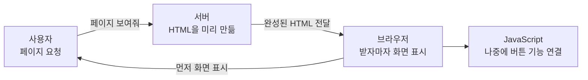
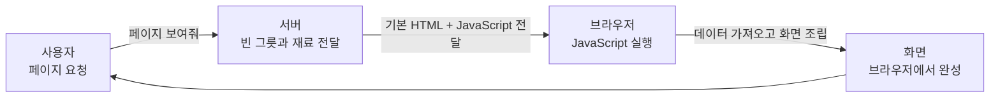
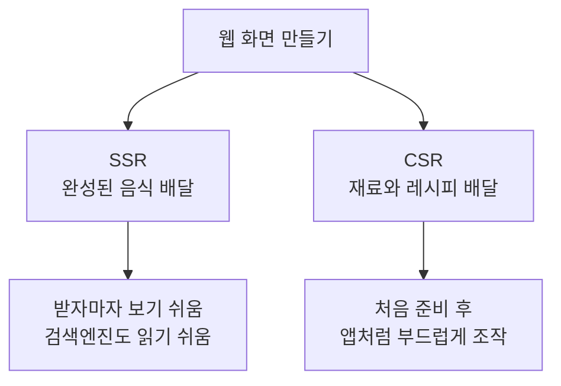

# SSR vs CSR

## 한 줄 설명

- SSR(Server Side Rendering): 서버가 완성된 HTML 화면을 만들어서 보내는 방식.
- CSR(Client Side Rendering): 브라우저가 JavaScript를 실행해서 화면을 만드는 방식.

쉽게 말하면 SSR은 "주방에서 완성된 음식을 받아오는 것"이고, CSR은 "재료를 받아서 손님 자리에서 직접 조리하는 것"에 가깝다.

## 왜 필요한가

웹사이트는 결국 사용자의 브라우저에 화면을 보여줘야 한다.

그런데 화면을 어디서 만들지에 따라 사용자가 느끼는 속도, 검색엔진 노출, 서버 부담, 개발 방식이 달라진다.

- 서버에서 미리 만들어서 보낼 것인가?
- 브라우저에서 나중에 만들게 할 것인가?

이 차이가 SSR과 CSR의 핵심이다.

---

## 먼저 그림으로 보기

### SSR

SSR은 서버가 HTML을 거의 완성해서 브라우저에게 보내준다.

비유하면 식당 주방에서 완성된 음식을 가져다주는 방식이다. 손님은 음식을 받자마자 바로 볼 수 있다.

### CSR

CSR은 서버가 최소한의 HTML과 JavaScript 파일을 보내고, 브라우저가 JavaScript를 실행해서 화면을 만든다.

비유하면 주방에서 재료와 레시피만 받고, 손님 자리에서 직접 조리해서 완성하는 방식이다.

---

## SSR

### 설명

SSR은 서버가 화면에 필요한 HTML을 먼저 만든 뒤 브라우저에 보내는 방식이다.

브라우저는 HTML을 받자마자 화면을 빠르게 보여줄 수 있다. 이후 JavaScript가 로드되면 버튼 클릭, 입력, 페이지 이동 같은 동작이 연결된다.

이처럼 이미 보이는 HTML에 JavaScript 동작을 붙이는 과정을 Hydration이라고 한다.

### 흐름

1. 사용자가 페이지에 접속한다.
2. 서버가 필요한 데이터를 가져온다.
3. 서버가 HTML을 만든다.
4. 브라우저가 HTML을 받아 화면을 보여준다.
5. JavaScript가 로드되면 화면에 동작이 붙는다.

### 장점

- 첫 화면을 빠르게 보여주기 좋다.
- 검색엔진이 내용을 읽기 쉽다.
- 공유 링크 미리보기, 메타 태그 처리에 유리하다.

### 단점

- 요청이 많으면 서버 부담이 커질 수 있다.
- 페이지마다 서버 렌더링 과정이 필요할 수 있다.
- Hydration 전에는 화면은 보여도 일부 버튼이 바로 동작하지 않을 수 있다.

### 어울리는 경우

- 블로그
- 뉴스
- 쇼핑몰 상품 상세 페이지
- 검색엔진 노출이 중요한 서비스
- 첫 화면 속도가 중요한 페이지

---

## CSR

### 설명

CSR은 브라우저가 JavaScript를 실행해서 화면을 만드는 방식이다.

처음에는 거의 비어 있는 HTML을 받고, 이후 JavaScript 파일을 다운로드한 뒤 필요한 데이터를 가져와 화면을 조립한다.

### 흐름

1. 사용자가 페이지에 접속한다.
2. 서버가 기본 HTML과 JavaScript 파일을 보낸다.
3. 브라우저가 JavaScript를 다운로드한다.
4. 브라우저가 JavaScript를 실행한다.
5. 필요한 데이터를 API로 가져와 화면을 만든다.

### 장점

- 한 번 로드된 뒤에는 화면 전환이 부드럽다.
- 앱처럼 인터랙션이 많은 서비스에 잘 맞는다.
- 서버는 주로 정적 파일과 API 응답만 제공하면 된다.

### 단점

- 첫 화면이 늦게 보일 수 있다.
- JavaScript 파일이 크면 사용자가 빈 화면을 오래 볼 수 있다.
- 검색엔진이 내용을 읽기 어려운 경우가 있다.

### 어울리는 경우

- 관리자 페이지
- 대시보드
- 메일, 캘린더 같은 웹앱
- 로그인 후 사용하는 내부 서비스
- 검색엔진 노출보다 사용자 조작성이 중요한 서비스

---

## 비교표

| 구분 | SSR | CSR |
| --- | --- | --- |
| 화면을 만드는 곳 | 서버 | 브라우저 |
| 처음 받는 HTML | 내용이 들어 있음 | 거의 비어 있음 |
| 첫 화면 표시 | 빠른 편 | JavaScript 로드 후 표시 |
| 화면 전환 | 서버 요청이 개입될 수 있음 | 앱처럼 부드러운 편 |
| 검색엔진 노출 | 유리함 | 불리할 수 있음 |
| 서버 부담 | 상대적으로 큼 | 상대적으로 작음 |
| 대표 사용처 | 블로그, 쇼핑몰, 뉴스 | 대시보드, 관리자, 웹앱 |

## 자주 헷갈리는 부분

### SSR이면 JavaScript를 안 쓰는가?

아니다. SSR도 JavaScript를 사용한다. 다만 첫 HTML을 서버가 만들어서 보내고, 브라우저에서는 그 HTML에 동작을 연결한다.

### CSR은 무조건 느린가?

아니다. 처음 로딩은 느릴 수 있지만, 한 번 로드된 뒤에는 페이지 전환이 빠르고 부드러울 수 있다.

### SSR이 항상 더 좋은가?

아니다. 검색 노출과 첫 화면이 중요하면 SSR이 유리하고, 로그인 후 복잡한 조작이 많은 앱은 CSR이 더 단순하고 적합할 수 있다.

### Nuxt나 Next.js는 SSR만 하는가?

아니다. Nuxt와 Next.js 같은 프레임워크는 SSR, CSR, SSG 등 여러 렌더링 방식을 상황에 맞게 선택할 수 있게 도와준다.

## 기억하기 쉬운 비유

- SSR은 완성된 음식을 받는 방식이다.
- CSR은 재료와 레시피를 받아 자리에서 조리하는 방식이다.
- SEO와 첫 화면이 중요하면 SSR을 먼저 생각한다.
- 로그인 후 조작이 많은 앱이면 CSR을 먼저 생각한다.

## 요약

- SSR은 서버가 화면을 만들어서 브라우저에 보낸다.
- CSR은 브라우저가 JavaScript로 화면을 만든다.
- SSR은 첫 화면과 검색엔진에 유리하다.
- CSR은 앱처럼 부드러운 사용자 경험에 유리하다.
- 중요한 것은 둘 중 하나가 무조건 좋은 게 아니라, 페이지의 목적에 맞게 선택하는 것이다.
